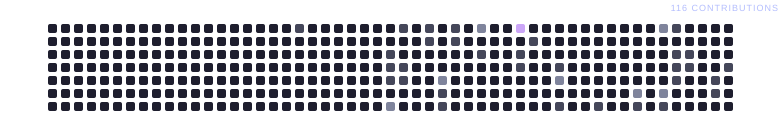

~~~aura width=860 height=930
(function() {
  var languages = ['TypeScript', 'JavaScript', 'CSS', 'Python'];

  var stats = [
    { label: 'Repos', value: String((github && github.stats && github.stats.totalRepos) || 0) },
    { label: 'Stars', value: String((github && github.stats && github.stats.totalStars) || 0) },
    { label: 'Forks', value: String((github && github.stats && github.stats.totalForks) || 0) },
    { label: 'Commits', value: String((github && github.stats && github.stats.totalCommits) || 0) },
  ];

  var stack = (github && github.languages && github.languages.length > 0)
    ? github.languages.slice(0, 6)
    : [
        { name: 'TypeScript', percentage: 38, color: '#b9a7e8' },
        { name: 'JavaScript', percentage: 28, color: '#9f8bd2' },
        { name: 'Python', percentage: 15, color: '#8e76bd' },
        { name: 'CSS', percentage: 10, color: '#c6b5f0' },
        { name: 'HTML', percentage: 6, color: '#7961a9' },
        { name: 'Other', percentage: 3, color: '#66508f' },
      ];

  var repositories = (github && github.repos && github.repos.length > 0)
    ? github.repos.slice(0, 3)
    : [
        { name: 'Featured project', description: 'A project built with curiosity and code.', stars: 0, forks: 0, language: 'TypeScript' },
        { name: 'Open source', description: 'Learning, experimenting and sharing.', stars: 0, forks: 0, language: 'JavaScript' },
        { name: 'Latest build', description: 'Turning ideas into useful software.', stars: 0, forks: 0, language: 'Python' },
      ];

  return (
    

      <svg width="860" height="930" style={{ position: 'absolute', top: 0, left: 0 }}>
        <defs>
          <pattern id="aura-grid" width="30" height="30" patternUnits="userSpaceOnUse">
            <path d="M30 0H0V30" fill="none" stroke="rgba(185,167,232,0.045)" strokeWidth="1" />
          </pattern>
          <radialGradient id="aura-purple" cx="50%" cy="50%" r="50%">
            <stop offset="0%" stopColor="rgba(154,126,216,0.38)" />
            <stop offset="55%" stopColor="rgba(117,88,181,0.14)" />
            <stop offset="100%" stopColor="rgba(117,88,181,0)" />
          </radialGradient>
          <radialGradient id="aura-blue" cx="50%" cy="50%" r="50%">
            <stop offset="0%" stopColor="rgba(91,132,180,0.17)" />
            <stop offset="100%" stopColor="rgba(91,132,180,0)" />
          </radialGradient>
        </defs>
        <rect width="860" height="930" fill="url(#aura-grid)" />
        <ellipse cx="160" cy="300" rx="330" ry="250" fill="url(#aura-purple)">
          <animate attributeName="opacity" values="0.35;0.7;0.35" dur="10s" repeatCount="indefinite" />
          <animateTransform attributeName="transform" type="translate" values="0 0;80 0;0 0" dur="12s" repeatCount="indefinite" />
        </ellipse>
        <ellipse cx="730" cy="155" rx="280" ry="220" fill="url(#aura-blue)">
          <animate attributeName="opacity" values="0.3;0.58;0.3" dur="12s" repeatCount="indefinite" />
          <animateTransform attributeName="transform" type="translate" values="0 0;-70 35;0 0" dur="14s" repeatCount="indefinite" />
        </ellipse>
        <ellipse cx="560" cy="660" rx="320" ry="210" fill="url(#aura-purple)" opacity="0.2" />
        <path d="M25 55V27H53" fill="none" stroke="rgba(198,181,240,0.55)" strokeWidth="2" />
        <path d="M807 875H835V847" fill="none" stroke="rgba(198,181,240,0.55)" strokeWidth="2" />
        <circle cx="86" cy="83" r="2" fill="rgba(198,181,240,0.5)" />
        <circle cx="766" cy="177" r="2" fill="rgba(198,181,240,0.4)" />
      </svg>

      

        Jean Patrick
        Software Engineer | TypeScript · JavaScript · Next.js · React · Node.js
        COMPUTER ENGINEERING STUDENT
        

          {languages.map(function(language) {
            return (
              {language}
            );
          })}
        

      

      

        {stats.map(function(stat) {
          return (
            

              {stat.value}
              {stat.label.toUpperCase()}
            

          );
        })}
      

      

        STACK ANALYTICS
        

          {stack.map(function(language) {
            return 
;
          })}
        

        

          {stack.map(function(language) {
            return (
              

                
                {language.name}
                {String(language.percentage) + '%'}
              

            );
          })}
        

      

      

        

          ACTIVITY PULSE
          LAST 12 MONTHS
        

        
      

      

        PRIMARY DEPLOYMENTS
        

          {repositories.map(function(repository, index) {
            var accent = ['#b9a7e8', '#9f8bd2', '#c6b5f0'][index] || '#8e76bd';
            return (
              

                {repository.name}
                {repository.description || 'Open-source project'}
                

                  
                  {repository.language || 'Project'}
                  {'★ ' + String(repository.stars || 0) + ' ⑂ ' + String(repository.forks || 0)}
                

              

            );
          })}
        

      

      

        BUILD · LEARN · SHARE
      

    

  );
})()
~~~

 

LET'S CONNECT

~~~aura width=150 height=44 link="https://www.linkedin.com/in/jeanpatrickm/" inline align=center
<SocialMediaButton
  icon="https://img.icons8.com/ios-filled/50/ffffff/linkedin.png"
  text="LinkedIn"
  backgroundColor="#171320"
  textColor="#f5f1fc"
  borderColor="#8f79bd"
  width={150}
  height={44}
  iconSize="20"
  gradientStops={[
    { offset: '0%', color: '#5f4b87' },
    { offset: '30%', color: '#b9a7e8' },
    { offset: '55%', color: '#7961a9' },
    { offset: '78%', color: '#d2c5f0' },
    { offset: '100%', color: '#5f4b87' },
  ]}
/>
~~~

~~~aura width=150 height=44 link="https://www.instagram.com/jeanpatrickm_/" inline align=center
<SocialMediaButton
  icon="https://img.icons8.com/ios-filled/50/ffffff/instagram-new.png"
  text="Instagram"
  backgroundColor="#171320"
  textColor="#f5f1fc"
  borderColor="#8f79bd"
  width={150}
  height={44}
  iconSize="20"
  gradientStops={[
    { offset: '0%', color: '#5f4b87' },
    { offset: '30%', color: '#b9a7e8' },
    { offset: '55%', color: '#7961a9' },
    { offset: '78%', color: '#d2c5f0' },
    { offset: '100%', color: '#5f4b87' },
  ]}
/>
~~~

~~~aura width=140 height=44 link="https://www.youtube.com/@jeanpatrickm01" inline align=center
<SocialMediaButton
  icon="https://img.icons8.com/ios-filled/50/ffffff/youtube-play.png"
  text="YouTube"
  backgroundColor="#171320"
  textColor="#f5f1fc"
  borderColor="#8f79bd"
  width={140}
  height={44}
  iconSize="20"
  gradientStops={[
    { offset: '0%', color: '#5f4b87' },
    { offset: '30%', color: '#b9a7e8' },
    { offset: '55%', color: '#7961a9' },
    { offset: '78%', color: '#d2c5f0' },
    { offset: '100%', color: '#5f4b87' },
  ]}
/>
~~~

~~~aura width=130 height=44 link="mailto:jean_patrick115@hotmail.com" inline align=center
<SocialMediaButton
  icon="https://img.icons8.com/ios-filled/50/ffffff/new-post.png"
  text="Email"
  backgroundColor="#171320"
  textColor="#f5f1fc"
  borderColor="#8f79bd"
  width={130}
  height={44}
  iconSize="20"
  gradientStops={[
    { offset: '0%', color: '#5f4b87' },
    { offset: '30%', color: '#b9a7e8' },
    { offset: '55%', color: '#7961a9' },
    { offset: '78%', color: '#d2c5f0' },
    { offset: '100%', color: '#5f4b87' },
  ]}
/>
~~~

 

  Powered by <a href="https://github.com/collectioneur/readme-aura">readme-aura</a>

